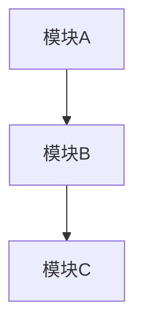

# Record-Docs 参考

## 文档分类规则（语义理解）

根据对话内容自动判断：

| 关键词/场景 | 分类 | 示例 |
|-------------|------|------|
| 新功能、实现 XX 功能、添加 XX | Feature | 用户登录、数据导出 |
| 架构、模块划分、系统设计、技术选型 | Architecture | 微服务拆分、分层设计 |
| 修复、Bug、问题解决 | Bug Fix | 修复日期显示错误 |
| 性能、优化、加速、缓存 | Performance | 列表虚拟滚动优化 |
| 需求、规格、PRD | Requirement | 用户故事、验收标准 |
| 任务规划、计划、拆分 | Task Planning | 迭代计划、里程碑 |

若难以判断，优先归入 **Feature**。

---

## 文档模板

### Feature 模板

```markdown
# [功能名称]

**创建日期**: YYYY-MM-DD

## 目录
（若章节 > 5 则添加）

## 1. Background
[背景与动机]

## 2. User Input Summary
[用户原始意图，尽量保留原话或核心诉求]

## 3. AI Design Summary
[AI 设计方案概要]

## 4. Implementation Details
[实现细节：文件、函数、关键逻辑]

## 5. Completion Status Table
| 项目 | 状态 |
|------|------|
| 功能 A | ✅ 完成 |
| 功能 B | ✅ 完成 |

## 6. Technical Decisions
[技术选型、取舍原因]

## 7. Future Improvements
[后续可优化点]
```

### Architecture 模板

```markdown
# [架构名称]

**创建日期**: YYYY-MM-DD

## 1. Background
[架构背景与目标]

## 2. User Input Summary
[用户原始意图]

## 3. AI Design Summary
[架构设计概要]

## 4. Architecture Diagram



## 5. Implementation Details
[实现落地说明]

## 6. Technical Decisions
[架构决策及理由]

## 7. Future Improvements
[演进方向]
```

### Bug Fix 模板

```markdown
# BUGFIX: [问题简述]

**创建日期**: YYYY-MM-DD

## 1. Background
[问题现象与影响]

## 2. User Input Summary
[用户原始描述]

## 3. Root Cause
[根因分析]

## 4. Solution
[修复方案与实现]

## 5. Technical Decisions
[为何采用此方案]

## 6. Future Improvements
[预防措施或后续改进]
```

### Performance 模板

```markdown
# PERFORMANCE: [优化项名称]

**创建日期**: YYYY-MM-DD

## 1. Background
[性能问题描述与指标]

## 2. User Input Summary
[用户原始诉求]

## 3. AI Design Summary
[优化方案概要]

## 4. Implementation Details
[具体实现]

## 5. Results
[优化前后对比]

## 6. Technical Decisions
[技术选型]

## 7. Future Improvements
[进一步优化空间]
```

### Requirement 模板

```markdown
# REQUIREMENTS: [需求名称]

**创建日期**: YYYY-MM-DD

## 1. Background
[需求背景]

## 2. User Input Summary
[用户原始需求描述]

## 3. Requirements
- 需求 1
- 需求 2

## 4. Acceptance Criteria
- 验收标准 1
- 验收标准 2

## 5. Technical Decisions
[实现相关决策]

## 6. Future Improvements
[后续扩展]
```

### Task Planning 模板

```markdown
# PLAN: [任务名称]

**创建日期**: YYYY-MM-DD

## 1. Background
[任务背景]

## 2. User Input Summary
[用户原始意图]

## 3. Plan Overview
[计划概要]

## 4. Milestones / Tasks
| 序号 | 任务 | 状态 |
|------|------|------|
| 1 | 任务 A | 待办/进行中/完成 |
| 2 | 任务 B | 待办 |

## 5. Technical Decisions
[规划中的技术决策]

## 6. Future Improvements
[后续规划]
```

---

## 中文 → 英文标识映射示例

| 中文 | 英文标识 |
|------|----------|
| 迷你可验证条 | MINI_VERIFICATION_BAR |
| 用户登录 | USER_LOGIN |
| 数据导出 | DATA_EXPORT |
| 日期显示错误 | DATE_DISPLAY_FIX |
| 列表虚拟滚动 | LIST_VIRTUAL_SCROLL |

规则：去除空格，用下划线连接，全大写。

---

## 更新已有文档

若目标文件已存在：

1. 读取现有内容
2. 合并新信息（补充 Implementation、Completion Status 等）
3. 保留原有结构，仅更新相关章节
4. 不覆盖用户已手写内容，除非明确为同一任务延续

---

## CHANGELOG 格式

```markdown
## [YYYY-MM-DD]

### Added
- Added [FEATURE_NAME] — 简要说明

### Fixed
- Fixed [BUG_DESCRIPTION]

### Changed
- Changed [CHANGE_DESCRIPTION]
```

按实际变更类型选择 `Added` / `Fixed` / `Changed`。
